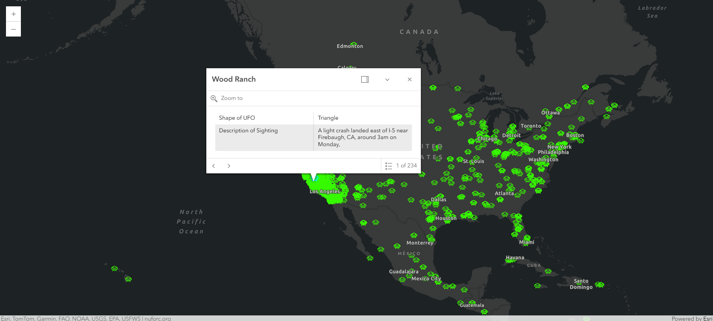

# Load a CSVLayer with a custom CIMSymbol for the renderer symbol

This project uses the ArcGIS JavaScript API 4.x to load a csv file hosted on this github repository as a CSVLayer. 

## Getting Started

This html file is ready for deployment. This sample uses  [NUFORC](https://nuforc.org/) data hosted as a csv file on github to load as a CSVLayer to visually display csv data on a two-dimensional map.

## How to use the sample

Run the application. Click on the symbols on the map to display a popup. The popup will contain information pulled from the NUFORC database to further describe the sightings reported for the location clicked.

## Deployment
One can deploy the application over a local web server (example: ISS), but it can also be ran directly from your computer by double clicking the html file when downloaded.

## Built With

* [ArcGIS Maps SDK for JavaScript](https://developers.arcgis.com/javascript/) - Using version 4.34.
