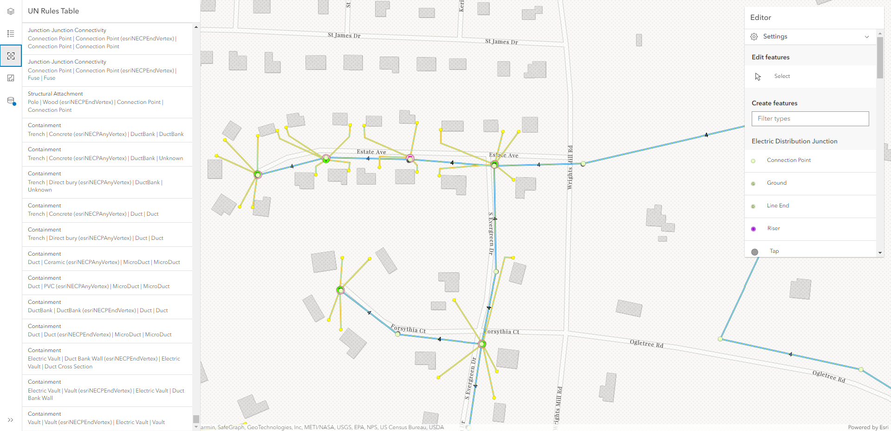

# Rule Based Snapping Tester

This project uses the ArcGIS JavaScript API 4.x to test Utility Network snapping rules. The application brings in the Editor and the RulesTable to constrain what features can be snapped to in editing workflows.

This application displays the rules table with all the rules in the utility network rules feature service in its own UI container. There is also a container that lists all the versions available to the logged in user to switch to, since we do not want to edit the default SDE version!

## Live App

[Rule Based Snapping Tester](https://banuelosj.github.io/jsapi-samples/4x/rule-based-snapping-tester)

## Built With

* [ArcGIS JavaScript API](https://developers.arcgis.com/javascript/) - Using the 4.28 JavaScript API

## Relevant API
* WebMap
* Editor
* VersionManagementService
* FeatureService
