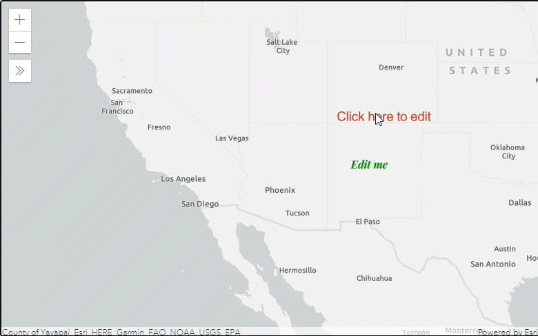

# Edit Text Symbol Font and Color with Calcite Components

This Typescript application was created to demonstrate how to edit `Graphics` with a `TextSymbol` using the ArcGIS API for JavaScript. This app utilized the `SketchViewModel` to allows users edit text for the `TextSymbol` by typing text into an [HTMLInputElement](https://developer.mozilla.org/en-US/docs/Web/API/HTMLInputElement).

This application uses the Esri [calcite-components](https://github.com/Esri/calcite-components) to display a color picker using the [calcite-color](https://github.com/Esri/calcite-components/tree/master/src/components/calcite-color) component. It also utilizes the [calcite-select](https://github.com/Esri/calcite-components/tree/master/src/components/calcite-select) and the [calcite-accordion](https://github.com/Esri/calcite-components/tree/master/src/components/calcite-accordion) to create a user interface where a user can update the font size, weight, style, and family.

A user can update existing text, text color, and text font by selecting a `Graphic`. Once a graphic is selected, the `SketchViewModel` fires the `update` event. An `Expand` widget expands to to display a `div` containing the calcite components. The app autopopulates the ui components with the values of the selected graphic. For example, the default color of the `calicte-color` will contain the color of the selected symbol.

## How to use the sample
1. Click on the `Graphic` on the `Map` to select the point graphic with a `TextSymbol`.
2. The `Expand` widget will open up a panel containing a text input, with a calcite-accordion. A user can select which properties of the graphic they would like to update by selecting the corresponding calcite-accordion-item. The accordion will expand revealing the calcite component that allows you to update the property values whether using the color picker or select and input elements.
3. Type some text into the input, and choose a color, or change a font property. Then click on the Update button to apply the changes on the graphic.
4. This will call the `complete()` method from the `SketchViewModel` to complete the editing operation. The text for the `TextSymbol` of the graphic will update with the text in the input, and the text color will match the color chosen with the color picker, as well as the fonts chosen..

## Getting Started

On the intitial download or clone of this repository run

### `npm install`

Installs all the package dependencies.

In the root project directory, you can run

### `tsc`

to compile the .ts files into .js files. Or run

### `tsc -w`

to compile and watch for any changes in the code.

## Deployment

The index.html file will be ready for deployment on a webserver, or just by double-clicking the file to launch from the local file directory.

## Built With

* [ArcGIS JavaScript API](https://developers.arcgis.com/javascript/) - Using the 4.18 JavaScript API
* [TypeScript](https://www.typescriptlang.org/)
* [calcite-components](https://github.com/Esri/calcite-components)

## Relevant API
* MapView
* SketchViewModel
* TextSymbol
* GraphicsLayer
* Graphic
* calcite-color
* calcite-accordion
* calcite-select

## [Live Sample](https://banuelosj.github.io/jsapi-samples/typescript-samples/sketch-text-symbol-font-picker/)