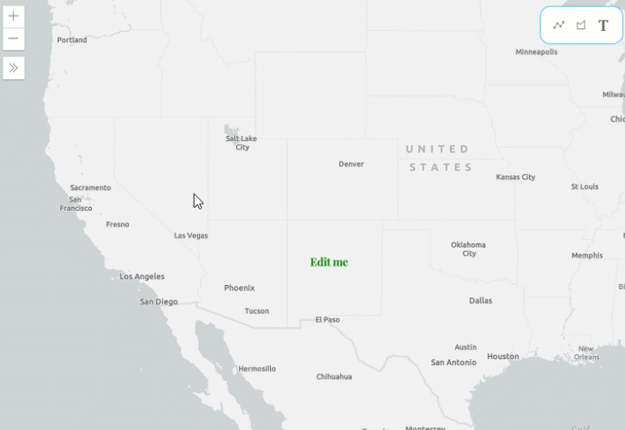

# Edit Text Symbol Graphics with Color Picker

This Typescript application was created to demonstrate how to edit `Graphics` with a `TextSymbol` using the ArcGIS API for JavaScript. This app utilized the `SketchViewModel` to allows users to add points, and add text for the `TextSymbol` by typing text into an [HTMLInputElement](https://developer.mozilla.org/en-US/docs/Web/API/HTMLInputElement).

This application uses the Esri [calcite-components](https://github.com/Esri/calcite-components) to display a color picker using the [calcite-color](https://github.com/Esri/calcite-components/tree/master/src/components/calcite-color) component.

A user can update existing text and text color by selecting a `Graphic`. Once a graphic is selected, the `SketchViewModel` fires the `update` event. An `Expand` widget expands to to display a `div` containing the HTMLInputElement and the calcite-color component. A user is able to update the color of the existing graphic, or edit the color and text of a new graphic added to the map.

## How to use the sample
1. Click on the `Graphic` on the `Map` to select the point graphic with a `TextSymbol`.
2. The `Expand` widget will open up with an `HTMLInputElement` and a `calcite-color` component, which displays a color picker, to allow a user to type text and change the text color.
3. Type some text into the input, and choose a color on the color picker. Then click on the Update button to apply the changes on the graphic.
4. This will call the `complete()` method from the `SketchViewModel` to complete the editing operation. The text for the `TextSymbol` of the graphic will update with the text in the input, and the text color will match the color chosen with the color picker.
5. A user can also click on the text button on the top right div to add a new point onto the map.
6. Once a new point is added to the map, it will stay in `update` mode, so a user can type text into the input to add text to the new graphic and its `TextSymbol`, or change its color.

## Getting Started

On the intitial download or clone of this repository run

### `npm install`

Installs all the package dependencies.

In the root project directory, you can run

### `tsc`

to compile the .ts files into .js files. Or run

### `tsc -w`

to compile and watch for any changes in the code.

## Deployment

The index.html file will be ready for deployment on a webserver, or just by double-clicking the file to launch from the local file directory.

## Built With

* [ArcGIS JavaScript API](https://developers.arcgis.com/javascript/) - Using the 4.18 JavaScript API
* [TypeScript](https://www.typescriptlang.org/)
* [calcite-components](https://github.com/Esri/calcite-components)

## Relevant API
* MapView
* SketchViewModel
* TextSymbol
* GraphicsLayer
* Graphic

## [Live Sample](https://banuelosj.github.io/jsapi-samples/typescript-samples/sketch-text-symbol-picker/)